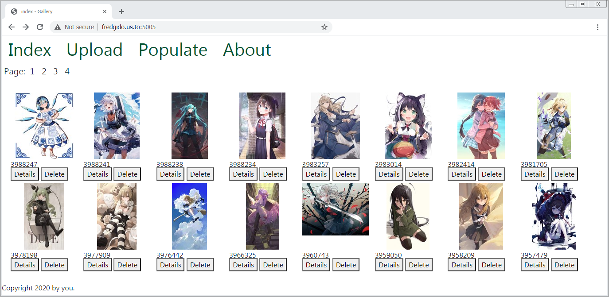

# galleryCRUD
Webpage to upload and list images



## Installation

Clone the repository locally.

You can build and run with docker:

```bash
docker build -t galleryCRUD:latest .
```

The application will be accessible at http://127.0.0.1:5000 or find the ip address of the virtua machine using `docker-machine ls` and the use the ip `http://<host_ip>:5000`

If installing on your machine do make use of a virtual environment, [venv](https://docs.python.org/3/library/venv.html):

Installing dependencies:

Use the package manager [pip](https://pip.pypa.io/en/stable/) to install dependencies.

```bash
pip install requirements.txt
```

## Usage

Run :
```bash
python run.py
```
Will be accessible on http://127.0.0.1:5000 

On the web UI there is a index, a post view that allows to view image full size and edit text description, a populate menu that grabs some images, about page and the UI for the GraphQL.

There is basic GraphQL endpoint at /graphql. REST HTTP API wise there is a endpoint at /api/post that can be used by calling the url with parameters or a json payload with the respective POST, GET, PATCH and DELETE methods. Examples:

```bash
$ curl -X DELETE http://localhost:5000/api/post?id=100
```
or

```bash
curl --request POST \
  --url http://localhost:5000/api/post \
  --header 'content-type: application/json' \
  --data '{
	"text": "examplefile",
	"file": "https://flask.palletsprojects.com/en/1.1.x/_images/flask-logo.png"
}'```
 for graphql


```
curl --request POST \
  --url http://localhost:5000/graphql \
  --header 'content-type: application/json' \
  --data '{"query":"{\n  allPosts {\n    edges {\n      node {\n        id\n        file\n        text\n      }\n    }\n  }\n}"}'
```
